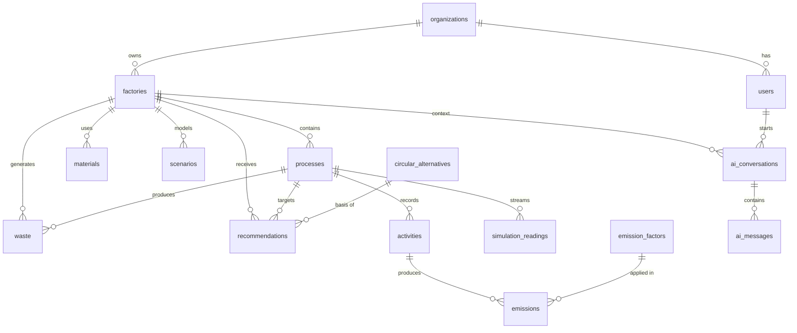

# EcoTrace AI — Domain Model

## 1. Core Domain Concepts

### Organization
Top-level business/tenant owning users and factories.

### User
Authenticated actor with a role.

### Factory
Physical/organizational production site.

### Process
A factory operation such as Furnace, Boiler, Assembly, Cutting, or Packaging.

### Activity
A dated operational measurement such as natural gas consumption, electricity consumption, material use, or production.

### Emission Factor
Factor used to convert an activity quantity into estimated CO2e.

### Emission
Persisted deterministic result of applying an emission factor to an activity.

### Material
Material consumed/managed by a factory.

### Waste
Waste generated by a factory/process.

### Circular Alternative
An intervention replacing or improving a current option.

### Recommendation
A candidate action evaluated for a specific factory/process.

### Scenario
A baseline-vs-intervention calculation.

### AI Conversation / Message
Persisted conversational context for the AI Copilot.

### Simulation Reading
Synthetic operational data used to demonstrate sensor-like streams.

## 2. Entity Relationship

```text
Organization
 ├── Users
 └── Factories
       ├── Processes
       │     └── Activities
       │            └── Emissions
       ├── Materials
       ├── Waste
       ├── Recommendations
       ├── Scenarios
       └── Simulation Readings

User ─── AI Conversations ─── AI Messages
```

### Initial ER Diagram



## 3. Relational Model

### organizations
```text
id
name
industry_type
created_at
updated_at
```

### users
```text
id
organization_id FK
name
email
password_hash
role
created_at
updated_at
```

### factories
```text
id
organization_id FK
name
industry_type
location
production_capacity
production_unit
created_at
updated_at
```

### processes
```text
id
factory_id FK
name
process_type
description
created_at
```

### activities
```text
id
process_id FK
activity_date
energy_type
quantity
unit
production_quantity
production_unit
source
created_at
```

### emission_factors
```text
id
category
source
fuel_type
unit            (activity unit, e.g. kWh)
factor          (co2e_unit per activity unit)
co2e_unit       (default kgCO2e)
region
year
reference
created_at
```

### emissions
```text
id
activity_id FK
emission_factor_id FK
co2e_value
co2e_unit
calculation_method
calculated_at
```

### materials
```text
id
factory_id FK
name
category
material_type
quantity
unit
created_at
```

### waste
```text
id
factory_id FK
process_id FK
waste_type
quantity
unit
disposal_method
created_at
```

### circular_alternatives
```text
id
category
current_option
alternative_option
description
reduction_percent
cost_level
implementation_difficulty
estimated_payback_years
circularity_score
created_at
```

### recommendations
```text
id
factory_id FK
process_id FK
alternative_id FK
score
estimated_reduction
estimated_cost
estimated_savings
payback_period
reason
status
created_at
```

### scenarios
```text
id
factory_id FK
name
description
baseline_emission
projected_emission
reduction_amount
reduction_percent
estimated_cost
estimated_savings
payback_period
created_at
```

### ai_conversations
```text
id
user_id FK
factory_id FK
created_at
```

### ai_messages
```text
id
conversation_id FK
role
content
tool_used
created_at
```

### simulation_readings
```text
id
process_id FK
timestamp
temperature
energy_consumption
fuel_consumption
estimated_emission
status          (NORMAL | ALERT)
is_simulated    (always true for hackathon readings)
```

### Enumerations & constraints

```text
Role                  ADMIN | FACTORY_OPERATOR | CONSULTANT | REGULATOR
ActivitySource        MANUAL | CSV | SIMULATION
RecommendationStatus  PENDING | ACCEPTED | REJECTED | IMPLEMENTED
AiMessageRole         USER | ASSISTANT | SYSTEM
SimulationStatus      NORMAL | ALERT

users.email                                   unique
users.organization_id                         required (every user belongs to an organization)
processes (factory_id, name)                  unique — CSV rows resolve processes by name
circular_alternatives (current, alternative)  unique
emissions.emission_factor_id                  ON DELETE RESTRICT (factors explain history)
factory children                              ON DELETE CASCADE
```

## 4. Domain Invariants

- An activity belongs to exactly one process.
- A process belongs to exactly one factory.
- An emission references the factor used to calculate it.
- A recommendation references a known circular alternative.
- A scenario has a baseline and projected state.
- Simulation readings are not physical measurements.
- Factory data must be authorized by organization/user scope.

## 5. Derived Metrics

### Total Emissions
```text
SUM(emissions.co2e_value)
```

### Emission Intensity
```text
CO2e / Production Quantity
```

### Process Contribution
```text
Process Emissions / Total Emissions × 100
```

### Reduction
```text
Baseline − Projected
```

### Reduction Percentage
```text
(Baseline − Projected) / Baseline × 100
```
